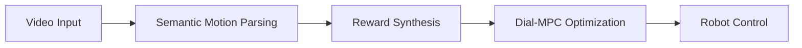

## Key files (paths)
## System Architecture

See → VLM extracts gait / velocity / contacts  
Do → Reward function generated automatically  
Sorted → Dial-MPC executes control

## System Pipeline

## Key files (paths)

- Environment: [`dial-mpc/dial_mpc/envs/unitree_go2_env.py`](dial-mpc/dial_mpc/envs/unitree_go2_env.py)
- Reward (SDS): [`dial-mpc/dial_mpc/envs/sds_reward_function.py`](dial-mpc/dial_mpc/envs/sds_reward_function.py)
- Planner (Dial-MPC): [`dial-mpc/dial_mpc/deploy/dial_plan.py`](dial-mpc/dial_mpc/deploy/dial_plan.py)
- Simulator loop: [`dial-mpc/dial_mpc/deploy/dial_sim.py`](dial-mpc/dial_mpc/deploy/dial_sim.py)
- Config example: [`dial-mpc/dial_mpc/examples/sds_gallop_sim.yaml`](dial-mpc/dial_mpc/examples/sds_gallop_sim.yaml)
